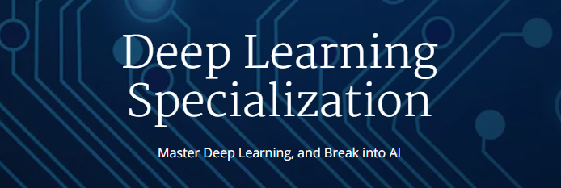

# Deep Learning Specialization

## Overview
This repository contains every material and worked solution of [`Deep Learning Specialization`](https://www.coursera.org/specializations/deep-learning) from Coursera.

## Contents

### Course 1: Neural Networks and Deep Learning

<table>
<tr>
    <td>Week 1</td>
    <td><a href="https://github.com/jihoon1990/Coursera_Deep_Learning/tree/master/Course_1_-_Neural_Networks_and_Deep_Learning/Week_1">Lecture Notes</a></td>
    <td></td>
    <td></td>
</tr>
<tr>
    <td>Week 2</td>
    <td><a href="https://github.com/jihoon1990/Coursera_Deep_Learning/tree/master/Course_1_-_Neural_Networks_and_Deep_Learning/Week_2">Lecture Notes</a></td>
    <td><a href="https://nbviewer.jupyter.org/github/jihoon1990/Coursera_Deep_Learning/blob/master/Course_1_-_Neural_Networks_and_Deep_Learning/Week_2/assignment/Python_Basics_with_Numpy_v3.ipynb">Assignment 1</a></td>
    <td><a href="https://nbviewer.jupyter.org/github/jihoon1990/Coursera_Deep_Learning/blob/master/Course_1_-_Neural_Networks_and_Deep_Learning/Week_2/assignment/Logistic_Regression_with_a_Neural_Network_Mindset_v3.ipynb">Assignment 2</a></td>
</tr>
<tr>
    <td>Week 3</td>
    <td><a href="https://github.com/jihoon1990/Coursera_Deep_Learning/tree/master/Course_1_-_Neural_Networks_and_Deep_Learning/Week_3">Lecture Notes</a></td>
    <td><a href="https://nbviewer.jupyter.org/github/jihoon1990/Coursera_Deep_Learning/blob/master/Course_1_-_Neural_Networks_and_Deep_Learning/Week_3/assignment/Planar_data_classification_with_one_hidden_layer_v3.ipynb">Assignment 1</a></td>
    <td></td>
</tr>
<tr>
    <td>Week 4</td>
    <td><a href="https://github.com/jihoon1990/Coursera_Deep_Learning/tree/master/Course_1_-_Neural_Networks_and_Deep_Learning/Week_4">Lecture Notes</a></td>
    <td><a href="https://nbviewer.jupyter.org/github/jihoon1990/Coursera_Deep_Learning/blob/master/Course_1_-_Neural_Networks_and_Deep_Learning/Week_4/assignment/Building_your_Deep_Neural_Network_-_Step_by_Step_v3.ipynb">Assignment 1</a></td>
    <td><a href="https://nbviewer.jupyter.org/github/jihoon1990/Coursera_Deep_Learning/blob/master/Course_1_-_Neural_Networks_and_Deep_Learning/Week_4/assignment/Deep_Neural_Network_-_Application_v3.ipynb">Assignment 2</a></td>
</tr>
</table>

### Course 2: Improving Deep Neural Networks: Hyperparameter tuning, Regularization and Optimization

<table>
<tr>
    <td>Week 1</td>
    <td><a href="https://github.com/jihoon1990/Coursera_Deep_Learning/tree/master/Course_2_-_Improving_Deep_Neural_Networks/Week_1">Lecture Notes</a></td>
    <td><a href="https://nbviewer.jupyter.org/github/jihoon1990/Coursera_Deep_Learning/blob/master/Course_2_-_Improving_Deep_Neural_Networks/Week_1/assignment/Initialization.ipynb">Assignment 1</a></td>
    <td><a href="https://nbviewer.jupyter.org/github/jihoon1990/Coursera_Deep_Learning/blob/master/Course_2_-_Improving_Deep_Neural_Networks/Week_1/assignment/Regularization.ipynb">Assignment 2</a></td>
    <td><a href="https://nbviewer.jupyter.org/github/jihoon1990/Coursera_Deep_Learning/blob/master/Course_2_-_Improving_Deep_Neural_Networks/Week_1/assignment/Gradient_Checking.ipynb">Assignment 3</a></td>
</tr>
<tr>
    <td>Week 2</td>
    <td><a href="https://github.com/jihoon1990/Coursera_Deep_Learning/tree/master/Course_2_-_Improving_Deep_Neural_Networks/Week_2">Lecture Notes</a></td>
    <td><a href="https://nbviewer.jupyter.org/github/jihoon1990/Coursera_Deep_Learning/blob/master/Course_2_-_Improving_Deep_Neural_Networks/Week_2/assignment/Optimization_methods.ipynb">Assignment 1</a></td>
</tr>
<tr>
    <td>Week 3</td>
    <td><a href="https://github.com/jihoon1990/Coursera_Deep_Learning/tree/master/Course_2_-_Improving_Deep_Neural_Networks/Week_3">Lecture Notes</a></td>
    <td><a href="https://nbviewer.jupyter.org/github/jihoon1990/Coursera_Deep_Learning/blob/master/Course_2_-_Improving_Deep_Neural_Networks/Week_3/assignment/Tensorflow_Tutorial.ipynb">Assignment 1</a></td>
</tr>
</table>

### Course 3: Structuring Machine Learning Projects

<table>
<tr>
<tr>
    <td>Week 1</td>
    <td><a href="https://github.com/jihoon1990/Coursera_Deep_Learning/tree/master/Course_3_-_Structuring_Machine_Learning_Projects/Week_1">Lecture Notes</a></td>
</tr>
</tr>
<tr>
    <td>Week 2</td>
    <td><a href="https://github.com/jihoon1990/Coursera_Deep_Learning/tree/master/Course_3_-_Structuring_Machine_Learning_Projects/Week_2">Lecture Notes</a></td>
</tr>
</table>

### Course 4: Convolutional Neural Networks

<table>
<tr>
    <td>Week 1</td>
    <td><a href="https://github.com/jihoon1990/Coursera_Deep_Learning/tree/master/Course_4_-_Convolutional_Neural_Networks/Week_1">Lecture Notes</a></td>
    <td><a href="http://nbviewer.jupyter.org/github/jihoon1990/Coursera_Deep_Learning/blob/master/Course_4_-_Convolutional_Neural_Networks/Week_1/assignment/Convolution_model_-_Step_by_Step_-_v2.ipynb">Assignment 1</a></td>
    <td><a href="https://github.com/jihoon1990/Coursera_Deep_Learning/blob/master/Course_4_-_Convolutional_Neural_Networks/Week_1/assignment/Convolution_model_-_Application_-_v1.ipynb">Assignment 2</a></td>
</tr>
<tr>
    <td>Week 2</td>
    <td><a href="https://github.com/jihoon1990/Coursera_Deep_Learning/tree/master/Course_4_-_Convolutional_Neural_Networks/Week_2">Lecture Notes</a></td>
    <td><a href="http://nbviewer.jupyter.org/github/jihoon1990/Coursera_Deep_Learning/blob/master/Course_4_-_Convolutional_Neural_Networks/Week_2/assignment/Residual_Networks_-_v2.ipynb">Assignment 1</a></td>
    <td><a href="http://nbviewer.jupyter.org/github/jihoon1990/Coursera_Deep_Learning/blob/master/Course_4_-_Convolutional_Neural_Networks/Week_2/assignment/Keras_-_Tutorial_-_Happy_House_v2.ipynb">Assignment 2</a></td>
</tr>
<tr>
    <td>Week 3</td>
    <td><a href="https://github.com/jihoon1990/Coursera_Deep_Learning/tree/master/Course_4_-_Convolutional_Neural_Networks/Week_3">Lecture Notes</a></td>
    <td><a href="http://nbviewer.jupyter.org/github/jihoon1990/Coursera_Deep_Learning/blob/master/Course_4_-_Convolutional_Neural_Networks/Week_3/assignment/Autonomous_driving_application_-_Car_detection_-_v1.ipynb">Assignment 1</a></td>
</tr>
<tr>
    <td>Week 4</td>
    <td><a href="https://github.com/jihoon1990/Coursera_Deep_Learning/tree/master/Course_4_-_Convolutional_Neural_Networks/Week_4">Lecture Notes</a></td>
    <td><a href="http://nbviewer.jupyter.org/github/jihoon1990/Coursera_Deep_Learning/blob/master/Course_4_-_Convolutional_Neural_Networks/Week_4/assignment/Art_Generation_with_Neural_Style_Transfer_-_v2.ipynb">Assignment 1</a></td>
    <td><a href="http://nbviewer.jupyter.org/github/jihoon1990/Coursera_Deep_Learning/blob/master/Course_4_-_Convolutional_Neural_Networks/Week_4/assignment/Face_Recognition_for_the_Happy_House_-_v3.ipynb">Assignment 2</a></td>
</tr>
</table>

### Course 5: Sequence Models

<table>
<tr>
    <td>Week 1</td>
    <td><a href="https://github.com/jihoon1990/Coursera_Deep_Learning/tree/master/Course_5_-_Sequence_Models/Week_1">Lecture Notes</a></td>
    <td><a href="http://nbviewer.jupyter.org/github/jihoon1990/Coursera_Deep_Learning/blob/master/Course_5_-_Sequence_Models/Week_1/assignment/Building_a_Recurrent_Neural_Network_-_Step_by_Step_-_v3.ipynb">Assignment 1</a></td>
    <td><a href="http://nbviewer.jupyter.org/github/jihoon1990/Coursera_Deep_Learning/blob/master/Course_5_-_Sequence_Models/Week_1/assignment/Dinosaurus_Island_-_Character_level_language_model_final_-_v3.ipynb">Assignment 2</a></td>
    <td><a href="http://nbviewer.jupyter.org/github/jihoon1990/Coursera_Deep_Learning/blob/master/Course_5_-_Sequence_Models/Week_1/assignment/Improvise_a_Jazz_Solo_with_an_LSTM_Network_-_v1.ipynb">Assignment 3</a></td>
</tr>
<tr>
    <td>Week 2</td>
    <td><a href="https://github.com/jihoon1990/Coursera_Deep_Learning/tree/master/Course_5_-_Sequence_Models/Week_2">Lecture Notes</a></td>
    <td><a href="http://nbviewer.jupyter.org/github/jihoon1990/Coursera_Deep_Learning/blob/master/Course_5_-_Sequence_Models/Week_2/assignment/Operations_on_word_vectors_-_v2.ipynb">Assignment 1</a></td>
    <td><a href="http://nbviewer.jupyter.org/github/jihoon1990/Coursera_Deep_Learning/blob/master/Course_5_-_Sequence_Models/Week_2/assignment/Emojify_-_v2.ipynb">Assignment 2</a></td>
</tr>
<tr>
    <td>Week 3</td>
    <td><a href="https://github.com/jihoon1990/Coursera_Deep_Learning/tree/master/Course_5_-_Sequence_Models/Week_3">Lecture Notes</a></td>
    <td><a href="http://nbviewer.jupyter.org/github/jihoon1990/Coursera_Deep_Learning/blob/master/Course_5_-_Sequence_Models/Week_3/assignment/Neural_machine_translation_with_attention_-_v3.ipynb">Assignment 1</a></td>
    <td><a href="https://nbviewer.jupyter.org/github/jihoon1990/Coursera_Deep_Learning/blob/master/Course_5_-_Sequence_Models/Week_3/assignment/Trigger_word_detection_-_v1.ipynb">Assignment 2</a></td>
</tr>
</table>
